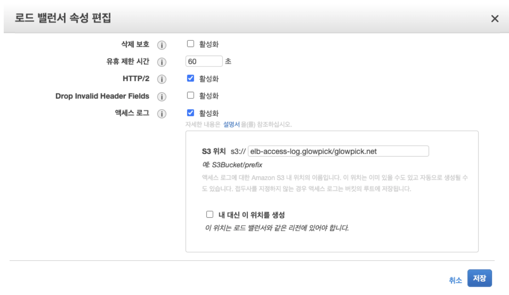

<hr />
본 포스팅은 제가 노션에 2021년 07월에 정리한것을 최대한 정리를 하여서 회사 개발 블로그에 정리한 내용입니다. 부족하더라도 이해해주세요. 감사합니다.

여러분 안녕하세요 글로우픽에서 백엔드 개발을 맡고있는 김대성입니다. 생각보다 블로그로 자주 인사드리게 되네요 :)  오늘은 저희쪽 AWS ELB 액세스로그를 가지고 Athena에서 로그 내역 쿼리로 확인하는 글을 써볼까 합니다. 
이미 예전에 급할때 주로 쓰다가 이참에 정리를 하고 이 글을 쓰게 되었습니다 🤔
<hr />

## Athena란?
[Amazon Athena](https://aws.amazon.com/ko/athena/?whats-new-cards.sort-by=item.additionalFields.postDateTime&whats-new-cards.sort-order=desc)는 표준 SQL을 사용해 Amazon S3에 저장된 데이터를 간편하게 분석할 수 있는 대화식 쿼리 서비스입니다.

Athena는 사용이 쉽습니다. Amazon S3에 저장된 데이터를 가리키고 스키마를 정의한 후 표준 SQL을 사용하여 쿼리를 시작하기만 하면 됩니다. 그러면 대부분 결과가 수 초 이내에 제공됩니다. Athena에서는 데이터 분석을 준비하기 위한 복잡한 ETL 작업이 필요 없습니다. 따라서 SQL을 다룰 수 있는 사람은 누구나 신속하게 대규모 데이터 세트를 분석할 수 있습니다.

공식사이트에서는 설명이 이렇게 잘되어 있습니다.


<br />

## Athena 도입 배경
ELB에서 자체적인 로그는 활성화였지만 필요한 시점에서 장애든 지속적인 요청이슈이든 급하게 처리할때가 필요할때 단순 ELB 액세스로그를 일일히 
사용자가 파악하지 않고 AWS에서 기존 로그 파일을 가지고 데이터 쿼리를 날릴수 있는 서비스가 있다고해서 도입하게 되었습니다.

<br />

## Athena 사전 셋팅 

### 1.로드 밸런서 속성 편집
먼저 로드 밸런서의 액세스 로그를 활성화를 하여야 합니다. 로그위치는 지정할 수 있으니 참고하시면 됩니다.

 
 
 
 
### 2.Athena 권한
저희는 일단 테스트를 할 예정이라 먼저 AthenaFullAccess로 먼저 주었습니다. 추후에 권한은 수정을 하셔야합니다.


### 3.Athena 쿼리 에디터로 가서 테이블을 생성

**데이터베이스 생성**
```
create database elb_db;
```

<br />

**테이블 생성**
```
CREATE EXTERNAL TABLE IF NOT EXISTS elb_glowpick_net_logs (
            type string,
            time string,
            elb string,
            client_ip string,
            client_port int,
            target_ip string,
            target_port int,
            request_processing_time double,
            target_processing_time double,
            response_processing_time double,
            elb_status_code string,
            target_status_code string,
            received_bytes bigint,
            sent_bytes bigint,
            request_verb string,
            request_url string,
            request_proto string,
            user_agent string,
            ssl_cipher string,
            ssl_protocol string,
            target_group_arn string,
            trace_id string,
            domain_name string,
            chosen_cert_arn string,
            matched_rule_priority string,
            request_creation_time string,
            actions_executed string,
            redirect_url string,
            lambda_error_reason string,
            target_port_list string,
            target_status_code_list string,
            new_field string
            )
            PARTITIONED BY(year string, month string, day string) 
						ROW FORMAT SERDE 'org.apache.hadoop.hive.serde2.RegexSerDe'
						WITH SERDEPROPERTIES (
            'serialization.format' = '1',
            'input.regex' = 
        '([^ ]*) ([^ ]*) ([^ ]*) ([^ ]*):([0-9]*) ([^ ]*)[:-]([0-9]*) ([-.0-9]*) ([-.0-9]*) ([-.0-9]*) (|[-0-9]*) (-|[-0-9]*) ([-0-9]*) ([-0-9]*) \"([^ ]*) ([^ ]*) (- |[^ ]*)\" \"([^\"]*)\" ([A-Z0-9-]+) ([A-Za-z0-9.-]*) ([^ ]*) \"([^\"]*)\" \"([^\"]*)\" \"([^\"]*)\" ([-.0-9]*) ([^ ]*) \"([^\"]*)\" \"([^\"]*)\" \"([^ ]*)\" \"([^\s]+)\" \"([^\s]+)\"(.*)')						
LOCATION 's3:로그경로';

```
elb에서 실제로 액세스 로그에 쌓을때 필요한 항목들을 이렇게 athena 테이블에 명시해줍니다.
자세한 항목에 대한 설명은 [Athena Create-Table](https://docs.aws.amazon.com/ko_kr/athena/latest/ug/create-table.html) 참고하시면 됩니다.

<br />

**파티션 데이터 밀어넣는법**
```
ALTER TABLE elb_db.elb_glowpick_net_logs add partition (year="2020", month="07", day="10")
location "로그경로/2020/07/10";
```
[공식 문서 -> 파티션](https://docs.aws.amazon.com/ko_kr/athena/latest/ug/alter-table-add-partition.html)에서는 이렇게 정의되어 있습니다.

테이블에 대해 하나 이상의 파티션 열을 만듭니다. 각 파티션은 하나 이상의 개별 열 이름/값 조합으로 구성됩니다
지정된 각각의 조합에 별개의 데이터 디렉터리가 생성되어 상황에 따라 쿼리 성능을 개선할 수 있습니다. 분할된 열은 테이블 데이터 자체 내에 존재하지 않으므로 테이블 자체의 열과 이름이 같은 열 이름을 사용하면 오류가 발생합니다. 
자세한 내용은 [데이터 파티셔닝을 참조](https://docs.aws.amazon.com/ko_kr/athena/latest/ug/partitions.html)


**쿼리 예시**
``` sql
select 
    type,
    time,
    elb,
    client_ip,
    client_port,
    target_ip,
    target_port,
    elb_status_code,
    request_verb,
    request_url,
    user_agent 
from elb_glowpick_net_logs 
where regexp_like(elb,'admin')
ORDER BY time desc LIMIT 5;
```